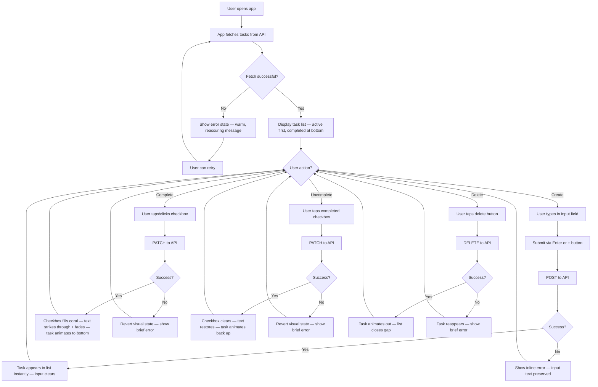
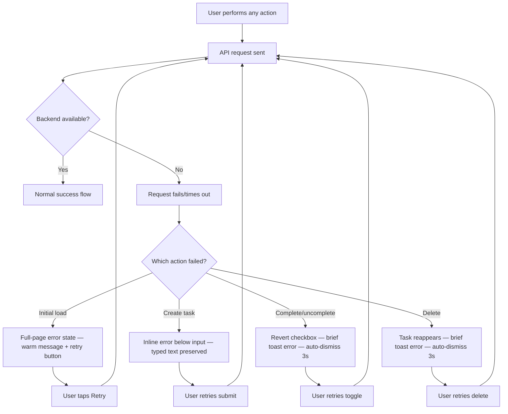

# UX Design Specification: todo

**Author:** chlo
**Date:** 2026-03-11

---

## Executive Summary

### Project Vision

Todo V1 is a deliberately minimal personal task management web app — create, view, complete, delete — where radical simplicity is the product philosophy, not a compromise. Every interaction should feel instant, obvious, and complete. The aesthetic is a well-organised paper notebook page: line-based, clean, careful. V1 is a BMAD training deliverable measured against PRD quality, but its architecture is quietly shaped by a future vision — a neurodiverse-first productivity tool for people who struggle with executive function, task paralysis, and the emotional weight of undone things.

### Target Users

V1 has no real user base — it's a training deliverable. Future personas (Maya the overwhelmed avoider, Sam the frustrated productive) inform architectural extensibility but don't drive V1 UX decisions. V1's UX is judged on its own terms: clean, obvious, instant, polished.

### Key Design Challenges

- Making minimal feel complete, not empty — four actions must feel like a finished product, not a prototype
- Achieving the "paper notebook page" aesthetic without tipping into wireframe-plain or over-styled
- Error and empty states that maintain the same level of polish as the happy path

### Design Opportunities

- Interaction micro-feedback as the product's signature — each of the four actions gets real attention and personality
- Pre-seeded first impression — sample tasks on first load set the tone immediately
- Responsive done right — small surface area means no excuse for breakpoints to feel like an afterthought

## Core User Experience

### Defining Experience

The core user action is **task creation** — it's the entry point to the entire product loop. If capturing a task feels even slightly heavy, the product fails at its most fundamental promise. View, complete, and delete matter, but they're all downstream of "I had a thought, now it's captured." Task creation must be near-zero friction: see the input, type, submit. No modals, no forms, no configuration.

### Platform Strategy

- Responsive web SPA (React), no native app, no PWA for V1
- Desktop and mobile browsers (modern evergreen only: Chrome, Firefox, Safari, Edge)
- Both mouse/keyboard and touch are first-class — not one adapting to the other
- No offline capability needed — single-user, always-connected is acceptable for V1
- No device-specific capabilities to leverage — the browser is the platform

### Effortless Interactions

- **Task creation:** Near-zero friction — see the input, type, submit. No modals, no forms, no configuration.
- **Completion toggle:** A single action — tap or click, done. The visual state change is the confirmation.
- **Deletion:** Immediate but not accidental — one deliberate action, not a multi-step confirmation dialog, but not so easy you delete by mistake.
- **Viewing tasks:** Automatic on load — no navigation, no "my tasks" button. Open the app, see the list.

### Critical Success Moments

1. **First load** — pre-seeded tasks create a populated, polished interface. The user decides "this feels real" or "this feels like a demo."
2. **First task created** — it appears instantly. The moment they think "that was easy" is the moment the product wins.
3. **First completion** — marking a task done should feel satisfying. A clear, tactile sense of "done" — like drawing a clean line through a notebook item.
4. **Return visit** — everything is exactly where they left it. Trust is established.

### Experience Principles

1. **Instant and obvious** — every action produces immediate, visible feedback. No loading spinners for CRUD operations. No ambiguity about what happened.
2. **Nothing to learn** — the interface is self-evident. If a new user needs to think about how to do something, the design has failed.
3. **Minimal and complete** — fewer things, done exceptionally well. The absence of features is a feature. The app should feel finished, not sparse.
4. **Quiet confidence** — the aesthetic communicates care without shouting. Clean lines, considered spacing, restrained palette. Like a well-made tool that doesn't need to explain itself.

## Desired Emotional Response

### Primary Emotional Goals

**Calm control.** Not the buzzy productivity-high of checking off 47 things in a power session. Something quieter. The feeling of opening a well-kept notebook where everything is where you put it. You're not overwhelmed, you're not behind — you're simply looking at your list, and it's manageable. The app doesn't demand anything from you. It waits.

### Emotional Journey Mapping

- **First load:** *Reassurance.* Pre-seeded tasks show a living, populated interface. The user relaxes — "I already understand this."
- **Creating a task:** *Relief.* The thought is captured. It's out of your head and into a trusted place. Speed reinforces the feeling — no friction means no anxiety.
- **Completing a task:** *Quiet satisfaction.* Like crossing something off a paper list with a clean pen stroke. A small, genuine "done."
- **Deleting a task:** *Lightness.* Something that no longer matters is gone. The list is cleaner. No guilt, no interrogation.
- **Something goes wrong:** *Trust preserved.* "That's okay, we'll try again" — not alarm, not blame. The app stays composed.
- **Returning to the app:** *Familiarity.* Everything is exactly where you left it. No surprises.

### Micro-Emotions

- **Confidence over confusion** — the most critical axis. Every pixel should say "you know how this works."
- **Trust over scepticism** — data persists, actions are predictable, the app does what it says.
- **Satisfaction over excitement** — V1 isn't trying to thrill anyone. It's trying to be the tool you trust without thinking about it.

**Emotions to Avoid:**
- **Overwhelm** — even with a long list, the design should feel contained and breathable
- **Guilt or pressure** — the app never implies you should be doing more
- **Uncertainty** — "did that save?" "is that task gone?" should never be questions

### Design Implications

- Calm control → generous whitespace, muted colour palette, no visual noise
- Quiet satisfaction on completion → subtle but definite visual transition (strikethrough, opacity shift, not confetti)
- Relief on creation → task appears in-place instantly, no page jump, no modal closing
- Trust preserved on error → error messages are warm and plain-spoken, the UI stays stable
- No guilt → no counters like "3 tasks overdue," no red badges, no urgency signals

### Emotional Design Principles

1. **The app waits for you** — it never demands, nudges, or implies urgency. It's a quiet, patient tool.
2. **Every action is its own reward** — completion feels satisfying through visual clarity, not gamification.
3. **Errors are human, not alarming** — when things go wrong, the tone is reassuring and the UI stays stable.
4. **Less emotion is more** — restraint in visual feedback creates trust. The app earns confidence by being predictable, not performative.

## Design System Foundation

### Design System Choice

**Tailwind CSS** — utility-first CSS framework with custom configuration as the design token layer.

### Rationale for Selection

- Balances current minimalism with future extensibility — one dependency today, a scalable token system tomorrow
- Full visual control for the "paper notebook page" aesthetic without fighting component library defaults
- Tree-shaken output means only used utilities ship to the browser — lean production CSS
- `tailwind.config` serves as the single source of truth for design tokens (colours, spacing, typography, breakpoints)
- Built-in responsive utilities and state variants (hover, focus, active) reduce custom CSS to near-zero
- Aligns with PRD mandate for minimal dependencies with clear justification

### Implementation Approach

- Configure Tailwind with a custom theme reflecting the notebook aesthetic — muted palette, considered spacing scale, clean typography
- Use Tailwind's utility classes directly in React components — no separate CSS files needed for most components
- Leverage `@apply` sparingly for repeated patterns that would benefit from abstraction
- Use Tailwind's responsive prefixes (`sm:`, `md:`, `lg:`) for mobile/desktop adaptation

### Customization Strategy

- Define design tokens in `tailwind.config`: colour palette, font stack, spacing scale, border radii, shadows
- Extend rather than override Tailwind defaults where possible — keep access to the full utility set
- As the product grows (Phase 2+), the config file scales naturally to accommodate new tokens for priority colours, status indicators, and additional UI patterns without restructuring

## Defining Experience

### The Core Interaction

**"Think it. Type it. It's captured."** — the purest possible version of getting something out of your head and into a trusted place. The speed and simplicity of task capture *is* the product. No categories, no dates, no priority — just text into a list, instantly.

### User Mental Model

Users bring the mental model of a paper list. Write something down, cross it off when done, scratch it out if you don't need it anymore. The app should feel exactly like that instinct, just digital. No new concepts to learn, no system to understand. The mental model is the design.

### Success Criteria

- Task creation in fewer than 3 seconds from intent to captured
- No decisions required to create a task — just text
- Completion is a single gesture (click/tap) with immediate visual confirmation
- Deletion is a single deliberate action — not hidden in a menu, not behind a confirmation
- The list is always there when you open the app — no login, no navigation, no loading that feels like waiting

### Novel UX Patterns

Entirely established patterns, executed with care. There is nothing novel and that's the point. Text input, list display, toggle, delete — all proven. The innovation is in the quality of execution, not the interaction model. The unique twist is radical restraint: doing less than every competitor, but doing it with more polish.

### Experience Mechanics

**Task Creation:**
1. *Initiation:* Input field is immediately visible and prominent — likely at the top of the view. On desktop, it may already have focus. On mobile, it's one tap away.
2. *Interaction:* User types a short description. Submits with Enter key (desktop) or a submit button (mobile). No other fields, no dropdowns, no options.
3. *Feedback:* Task appears in the list instantly. The input clears, ready for the next task. The new task's position in the list provides spatial confirmation.
4. *Completion:* The task is there. Done. Input is ready for another if they want, or they can walk away.

**Task Completion:**
1. *Initiation:* A clear affordance on each task (checkbox, circle, tap target) invites completion.
2. *Interaction:* Single click or tap.
3. *Feedback:* Visual state change — strikethrough, opacity reduction, or similar. The task doesn't vanish; it stays visible but clearly "done." Subtle transition rather than snap change.
4. *Completion:* Task remains in the list in its completed state. Reversible — tapping again uncompletes it.

**Task Deletion:**
1. *Initiation:* A delete affordance is accessible but not dominant — close enough to find, far enough from completion to avoid accidents.
2. *Interaction:* Single click or tap. No "are you sure?" dialog.
3. *Feedback:* Task disappears from the list with a smooth exit. The list closes the gap cleanly.
4. *Completion:* Task is gone. Permanent. No undo tray for V1.

## Visual Design Foundation

### Color System

**Design approach:** Mostly neutrals and pastels maintaining a calm aesthetic, with one accent colour for personality.

**Neutrals:**
- Background: `#FAFAF8` (warm off-white, like good quality paper)
- Surface: `#FFFFFF` (pure white for task items, creating subtle lift)
- Text primary: `#2D2D2D` (warm dark grey, not pure black)
- Text secondary: `#8B8B8B` (timestamps, placeholder text)
- Border/dividers: `#E8E6E3` (warm, subtle — faint ruled lines)
- Completed task text: `#B0AEA9` (noticeably faded, clearly "done")

**Accent — soft coral:** `#E8927C`
- Used sparingly for the primary interactive element
- Warm, approachable, human — the one splash of personality in a calm room

**Supporting pastels:**
- Hover/focus: `#F3EEEB` (barely-there warm tint)
- Success/completion: `#D4E4DA` (soft sage)
- Error background: `#F0D4CE` (muted warm pink) with `#C4705A` error text

All colour pairings meet WCAG AA contrast requirements (4.5:1 minimum).

### Typography System

**Font family:** Inter — proper, readable, quietly confident. One family, multiple weights.

**Type scale (mobile-first baseline → desktop at `md:` breakpoint):**
- App title/header: 18px semi-bold → 20px
- Task text: 16px regular (consistent across breakpoints)
- Secondary text: 13px regular → 14px
- Error/status: 13px medium → 14px

**Line heights:** 1.5 for body/task text, 1.3 for headings.

No secondary typeface. Restraint is the sophistication.

### Spacing & Layout Foundation

**Mobile-first design.** Default sizes target mobile viewports; desktop scales up.

**Base unit:** 8px

**Spacing scale (mobile baseline → desktop):**
- Horizontal page padding: 16px → 24px at `sm:`, 32px at `md:`
- Task item vertical padding: 12px → 16px at `md:`
- Input area to task list gap: 24px → 32px at `md:`
- Task text to action icons: 16px horizontal gap

**Layout:**
- Single-column, fluid on mobile, max-width 640px centred on desktop
- 1px borders between task items (the "ruled line" effect)
- Overall feel: airy, considered, unhurried — a page with wide margins

**Touch targets:** 44x44px minimum for all interactive elements, all breakpoints.

### Accessibility Considerations

- All text meets WCAG AA contrast ratio (4.5:1 minimum) against its background
- Focus states use visible 2px outlines in coral accent — not just colour change
- Interactive elements meet 44x44px minimum for motor accessibility
- Font sizes never below 13px (mobile) / 14px (desktop)
- Keyboard navigation fully supported with clear focus indicators

## Design Direction

### Design Directions Explored

Four directions were explored, sharing the same colour palette, typography, and spacing but varying in layout structure and interaction patterns:

- **A — Clean Ruled:** Ruled-line list, circle checkboxes, coral add button, inline completed tasks
- **B — Soft Cards:** Elevated card per task, rounded square checkboxes, text add button, timestamps visible
- **C — Minimal Flat:** Maximum restraint, square checkboxes, Enter-only submission, no visible timestamps
- **D — Sectioned:** Ruled lines with explicit Active/Done section separation and sage green completion

Design directions visualised in `ux-design-directions.html`.

### Chosen Direction

**Direction A — Clean Ruled** with completed tasks sorting to the bottom.

**Key elements:**
- App header displays **"To-do list"** (not the project name "todo")
- Ruled-line task list with 1px warm borders (the notebook ruled-line effect)
- Circle checkboxes with coral fill on completion
- Text input with coral "+" add button
- Completed tasks styled with strikethrough and faded text (`#B0AEA9`)
- Completed tasks sort to the bottom of the list automatically — no labelled sections, just natural reordering
- Delete affordance revealed on hover (desktop) — always accessible on mobile
- Flat list structure, no cards, no elevation — the notebook metaphor in its purest form

### Design Rationale

- **Ruled lines over cards** — truer to the paper notebook aesthetic. Cards add visual weight and modernity that conflicts with the calm, restrained personality.
- **Circle checkboxes** — softer and friendlier than squares, with the coral fill providing the one moment of colour personality on completion.
- **Completed tasks to bottom** — keeps the active work area focused without the overhead of labelled sections. The list self-organises.
- **Visible add button** — the coral "+" is clear, obvious, and serves as the single accent colour anchor. More discoverable than Enter-only, especially on mobile.

### Implementation Notes

- Task list ordering: active tasks first (by creation order), completed tasks below (by completion time, most recent at top)
- On completion toggle, task animates smoothly to its new position rather than snapping
- On uncomplete, task animates back up into the active section
- Delete button: use CSS opacity transition on parent hover for desktop; on mobile, show a smaller but always-tappable delete affordance

## User Journey Flows

### Core Task Management (Happy Path)

**Key flow details:**
- Every action follows an optimistic-or-wait pattern: API call happens, on success the UI updates instantly, on failure the UI reverts with a brief warm error.
- Create preserves input text on failure so the user doesn't lose what they typed.
- Complete/uncomplete reverts the visual toggle on failure — no ambiguous intermediate state.
- Delete animates the task out; on failure the task reappears.

### Error Recovery

**Error UX principles:**
- Error messages are warm and plain-spoken — "Something went wrong. Give it another try."
- The UI never enters a broken state. Failed actions revert cleanly.
- Error treatment scales by severity: full-page for initial load failure, inline for creation failure, brief toast for toggle/delete failures.
- No data is ever lost on the client side due to an error.

### Journey Patterns

- **Optimistic revert:** Every mutation shows pending state, then either confirms success or reverts on failure. The user always sees a clean resolution.
- **Error escalation:** Errors are proportional to severity. A failed toggle gets a brief toast; a failed initial load gets a full-page state.
- **Input preservation:** Text input is never cleared on failure. The user's work is always protected.

### Flow Optimisation Principles

- Zero navigation — every journey happens on a single page. No routing, no page transitions.
- Maximum one action per user intent — create is type + submit, complete is one tap, delete is one tap. No multi-step flows.
- Every state transition has visual feedback — no silent successes, no ambiguous outcomes.

## Component Strategy

### Design System Components

**Tailwind CSS** provides the utility layer — no pre-built UI components. All components are custom React components styled with Tailwind utility classes, using design tokens defined in `tailwind.config`.

### Custom Components

All 11 components are custom-built for V1:

**AppShell** — outer page container. Centres content, applies warm off-white background (`#FAFAF8`), sets max-width. Fluid on mobile with 16px padding; 640px max centred on desktop.

**AppHeader** — the "To-do list" title. Static, non-interactive. 18px semi-bold on mobile, 20px on desktop.

**TaskInput** — text field + coral "+" add button. States: empty (placeholder visible), typing (text visible), error (inline error message below), disabled (during submission). Enter key and + button both submit. Clears on success, preserves text on failure. Accessibility: labelled input, coral focus ring, aria-label on submit button.

**TaskList** — ordered container rendering active tasks first, completed at bottom. States: loading (subtle skeleton/pulse), populated, empty (EmptyState component), error (ErrorState component). Handles sort ordering and animation of items moving between active/completed zones.

**TaskItem** — individual task row. Anatomy: checkbox | task text | delete button. States: active, completed (strikethrough + fade), hover (delete reveals on desktop), deleting (animating out). Each part independently keyboard-focusable with meaningful labels.

**Checkbox** — 20px circle completion toggle within 44x44px tap target. States: unchecked (empty circle, `#E8E6E3` border), checked (coral `#E8927C` fill + white checkmark), hover (slightly darker border). Accessibility: role="checkbox", aria-checked, Space key toggles.

**DeleteButton** — 28px × button within 44x44px tap target. States: hidden (default on desktop), visible (on row hover or always on mobile), hover (error-bg `#F0D4CE` tint). Accessibility: aria-label="Delete task: {task text}".

**Toast** — custom brief auto-dismissing notification (no library). States: entering (slide in from bottom), visible, exiting (auto-dismiss after 3s). Warm, plain-spoken error message. Positioned at bottom of viewport, centred.

**EmptyState** — shown when task list is empty. Warm, inviting message encouraging the first task. Disappears when first task is created.

**LoadingState** — shown during initial API fetch. Subtle skeleton or gentle pulse on the list area. Nearly invisible on fast connections.

**ErrorState** — full-page error for initial load failure. Warm message + coral retry button. Centred, calm design.

### Component Implementation Strategy

- All components built as React functional components with Tailwind utility classes
- Design tokens (colours, spacing, typography) defined once in `tailwind.config` and referenced throughout
- No component library dependencies — every component is purpose-built for this product
- Accessibility baked into each component from the start (ARIA roles, keyboard support, focus management)
- CSS transitions handled via Tailwind's transition utilities for hover, focus, and state changes
- List reordering animations may require a small animation approach (CSS transitions on position, or a lightweight solution)

### Implementation Roadmap

No phased rollout needed — all 11 components are required for V1 and the list is small enough to build in a single pass. Build order follows natural dependency:

1. AppShell → AppHeader (page structure)
2. TaskInput (creation flow)
3. TaskItem → Checkbox → DeleteButton (task display and interaction)
4. TaskList (ordering logic and container)
5. EmptyState → LoadingState → ErrorState (edge case states)
6. Toast (error feedback)

## UX Consistency Patterns

### Button Hierarchy

- **Primary action:** Coral `#E8927C` background, white text/icon. One per screen — the "+" add button.
- **Destructive action:** No background by default. On hover/focus: `#F0D4CE` background, `#C4705A` icon. The delete button.
- **Recovery action:** Coral background, white text. The retry button on error states — in an error context, recovery is the primary action.
- **Rule:** No outlines, no ghost buttons, no secondary buttons. The app is too simple to need a hierarchy.

### Feedback Patterns

- **Success:** No explicit notification. The UI state change is the feedback. Silence is the success signal.
- **Error (inline):** For task creation failure. Below the input field. `#C4705A` text on `#F0D4CE` background. Dismisses when user starts typing again.
- **Error (toast):** For toggle/delete failure. Slides in from bottom, auto-dismisses after 3s. Single line, no icon, no close button.
- **Error (full-page):** For initial load failure only. Centred message with retry button. Replaces the task list, not the whole page.
- **Rule:** Errors are never red. Always warm coral/pink tones. Errors are human, not alarming.

### Form Patterns

- Placeholder text in `#8B8B8B`. Focus: coral 2px outline. Typing: text in `#2D2D2D`. Submit: disabled state while API call is in flight.
- On error: inline error below, input text preserved, input remains editable.
- Validation: only "not empty" — empty submissions are silently ignored. No error message for empty input.
- No labels above the input. The placeholder and context make purpose self-evident.

### State Transition Patterns

- **No optimistic UI:** All mutations wait for API confirmation before updating the UI, but the wait should be imperceptible (< 200ms).
- **Revert on failure:** If an API call fails, UI reverts to previous state before showing the error. No inconsistent states.
- **Animation timing:** All transitions use a consistent 200ms ease-out curve.
- **No spinners for CRUD operations.** Loading state only appears for the initial page load.

### Empty State Pattern

- Appears when task list has zero tasks
- Warm, inviting copy — "Nothing here yet. What's on your mind?" not "No tasks found"
- Styled in `#8B8B8B` secondary text, centred in the list area
- Text-only, no illustrations or icons — consistent with minimal aesthetic

## Responsive Design & Accessibility

### Responsive Strategy

**Mobile-first, single breakpoint.** The app is a single-column layout at every viewport size. No layout changes, no collapsing navigation, no hamburger menus. The same structure works everywhere — only spacing and type sizes adapt.

- **Mobile (< 640px):** Fluid width, 16px horizontal padding. All default sizes target this viewport. Delete button always visible (no hover on touch).
- **Desktop (640px+):** Content caps at 640px centred. Padding scales to 24-32px. Type sizes scale up slightly. Delete button hidden by default, revealed on row hover. More vertical breathing room.
- **No tablet-specific breakpoint.** The centred max-width layout works identically on tablet and desktop.

### Breakpoint Strategy

Single meaningful breakpoint using Tailwind defaults:

| Breakpoint | Width | Purpose |
|------------|-------|---------|
| `sm:` | 640px | Mobile → desktop transition. Spacing, type size, and hover behaviour adapt. |

No `md:`, `lg:`, `xl:` breakpoints needed for V1.

### Accessibility Strategy

**Target: WCAG AA compliance** as specified in the PRD.

**Colour contrast:**
- Primary text `#2D2D2D` on `#FAFAF8`: ~11:1 (passes AAA)
- Secondary text `#8B8B8B` on `#FAFAF8`: ~3.8:1 — accepted trade-off for supplementary, non-essential content
- Completed text `#B0AEA9` on `#FFFFFF`: decorative — strikethrough communicates status independently
- Error text `#C4705A` on `#F0D4CE`: verify during implementation, adjust if needed

**Keyboard navigation:**
- Tab order follows natural DOM: input → submit → task checkboxes → task delete buttons
- Enter submits the input form
- Space toggles focused checkbox
- Focus never gets trapped — Tab always moves forward, Shift+Tab back
- Skip link at top of page jumps to task input for screen reader users

**Screen reader support:**
- Semantic HTML structure: `<main>`, `<h1>`, `<form>`, `<ul>`, `<li>`
- Input has associated label (visually hidden `<label>` or `aria-label`)
- Checkboxes: `role="checkbox"`, `aria-checked`, `aria-label="Mark [task text] as complete"`
- Delete buttons: `aria-label="Delete task: [task text]"`
- Task list: `aria-label="Task list, X items"`
- Toast errors: `role="alert"`, `aria-live="polite"`

**Touch accessibility:**
- All interactive elements: 44x44px minimum tap target
- Sufficient spacing between tap targets to prevent accidental activation
- No gesture-only interactions — everything accessible via tap

### Testing Considerations

- Test keyboard-only navigation through complete CRUD flow
- Verify screen reader announces task creation, completion, deletion, and errors
- Test on actual mobile devices (not just browser responsive mode)
- Validate touch target sizes on smallest supported viewport (320px)
- Verify focus indicators are visible against all background colours
